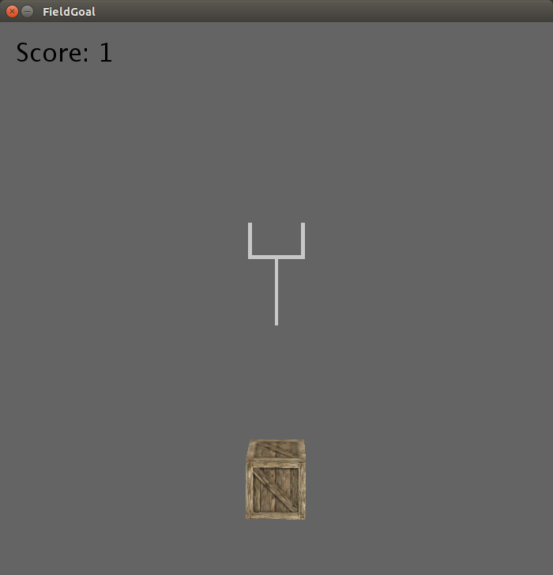
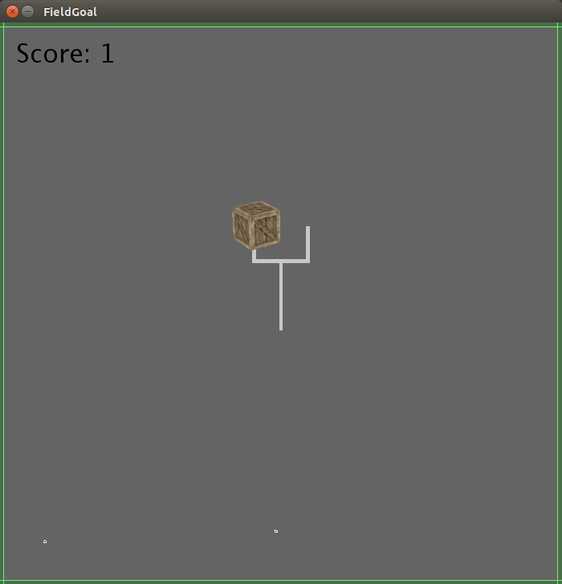

# FieldGoal

This project is coursework associated with Coursera's
[Creative Programming for Digital Media & Mobile Apps](https://www.coursera.org/course/digitalmedia).
It is a simple "game" where the player tries to kick a crate through a field
goal. Click on the crate to kick; where you click determines the force vector.
Press Enter to toggle a schematic overlay.




## Running (Command Line)
You'll need to have a working copy of **version 2.2.1** of
[Processing](https://processing.org/), a programming language geared at visual
arts. Download it and unzip; make note of the `processing-java` command it
contains.

Next, clone this repository into a folder named "FieldGoal". From one
directory above (i.e. the parent of the "FieldGoal" folder), execute:

```
/path/to/processing-java --sketch=FieldGoal --output=/tmp/some/where --run
```

## Running (IDE)
You'll need to have a working copy of **version 2.2.1** of 
[Processing](https://processing.org/), a
programming language geared at visual arts. Download it and unzip; open the
`processing` program it contains. This is Processing's IDE.

Next, clone this repository into a folder named "FieldGoal". Then, through
Processing's UI, select "File > Open" and navigate to the "FieldGoal.pde"
file. Once this is loaded, click the "Play" button.
